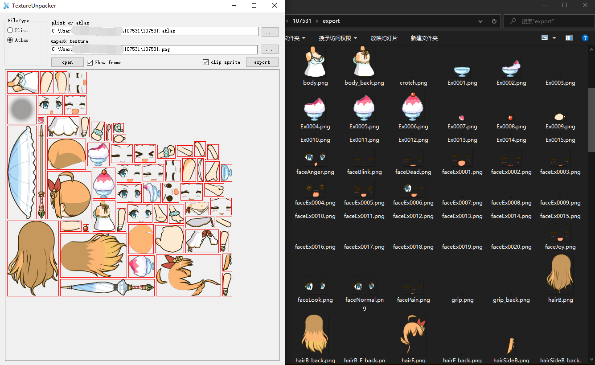

# TextureUnpacker
- can split plist file (*.plist) created by TexturePacker.
- can split atlas file (*.atlas) created by Atlas Maker.

# UI 
 

# reference
- [TextureUnpacke](https://github.com/aa13058219642/TextureUnpacker)